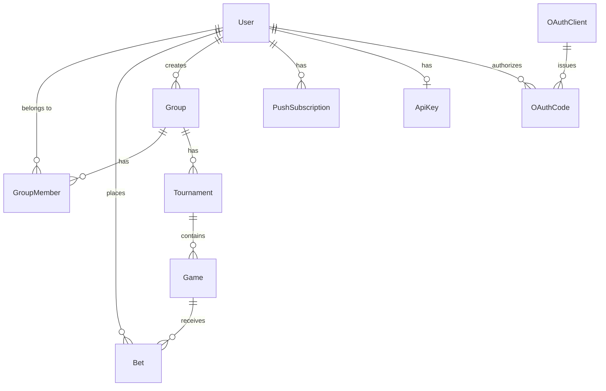

# Database Schema

> Prisma schema for the Football Betting App.  
> Copy this to `prisma/schema.prisma` during Phase 1 of the implementation.

```prisma
generator client {
  provider = "prisma-client-js"
}

datasource db {
  provider = "postgresql"
  url      = env("DATABASE_URL")
}

model User {
  id            String        @id @default(cuid())
  email         String        @unique
  passwordHash  String
  name          String
  createdAt     DateTime      @default(now())

  groupMembers       GroupMember[]
  bets               Bet[]
  createdGroups      Group[]            @relation("GroupCreator")
  pushSubscriptions  PushSubscription[]
  apiKey             ApiKey?
}

model ApiKey {
  id         String    @id @default(cuid())
  userId     String    @unique
  keyHash    String    @unique
  createdAt  DateTime  @default(now())
  lastUsedAt DateTime?

  user       User      @relation(fields: [userId], references: [id], onDelete: Cascade)
}

model Group {
  id          String        @id @default(cuid())
  name        String
  createdAt   DateTime      @default(now())
  createdBy   String
  creator     User          @relation("GroupCreator", fields: [createdBy], references: [id])

  members     GroupMember[]
  tournaments Tournament[]
}

model GroupMember {
  id        String   @id @default(cuid())
  groupId   String
  userId    String
  isAdmin   Boolean  @default(false)
  joinedAt  DateTime @default(now())

  group     Group    @relation(fields: [groupId], references: [id])
  user      User     @relation(fields: [userId], references: [id])

  @@unique([groupId, userId])
}

model Tournament {
  id                    String        @id @default(cuid())
  groupId               String
  name                  String        // e.g. "World Cup 2026"
  season                String?       // e.g. "2026"
  createdAt             DateTime      @default(now())
  exactScorePoints      Int           @default(3)
  correctOutcomePoints  Int           @default(1)

  group                 Group         @relation(fields: [groupId], references: [id])
  games                 Game[]
}

model Game {
  id           String     @id @default(cuid())
  tournamentId String
  homeTeam     String
  awayTeam     String
  kickoffAt    DateTime
  homeScore    Int?       // null until admin enters result
  awayScore    Int?       // null until admin enters result
  createdAt    DateTime   @default(now())

  tournament   Tournament @relation(fields: [tournamentId], references: [id])
  bets         Bet[]
}

enum BetResult {
  EXACT_SCORE
  CORRECT_OUTCOME
  INCORRECT
}

model Bet {
  id        String     @id @default(cuid())
  gameId    String
  userId    String
  homeScore Int
  awayScore Int
  betResult BetResult? // null until game result is entered
  createdAt DateTime   @default(now())
  updatedAt DateTime   @updatedAt

  game          Game     @relation(fields: [gameId], references: [id])
  user          User     @relation(fields: [userId], references: [id])

  @@unique([gameId, userId])  // one bet per user per game
}

model PushSubscription {
  id        String   @id @default(cuid())
  userId    String
  endpoint  String   @unique
  p256dh    String
  auth      String
  createdAt DateTime @default(now())

  user      User     @relation(fields: [userId], references: [id], onDelete: Cascade)
}

model OAuthClient {
  id           String   @id @default(cuid())
  clientName   String
  redirectUris String[]
  createdAt    DateTime @default(now())

  codes OAuthCode[]
}

model OAuthCode {
  id                  String      @id @default(cuid())
  clientId            String
  userId              String
  code                String      @unique @default(cuid())
  redirectUri         String
  codeChallenge       String
  codeChallengeMethod String      @default("S256")   // always "S256"
  expiresAt           DateTime                       // 10-min TTL from issuance
  used                Boolean     @default(false)    // one-time use
  createdAt           DateTime    @default(now())

  client OAuthClient @relation(fields: [clientId], references: [id])
  user   User        @relation(fields: [userId], references: [id])
}
```

## Entity Relationship Overview



## Key Constraints

| Constraint                         | Enforcement                                                                  |
| ---------------------------------- | ---------------------------------------------------------------------------- |
| One bet per user per game          | `@@unique([gameId, userId])`                                                 |
| Scoring points per tournament      | `exactScorePoints` / `correctOutcomePoints` on `Tournament` (defaults 3 / 1) |
| Game scores are nullable           | `homeScore Int?` / `awayScore Int?` — null until result entered              |
| Bet result is nullable             | `betResult BetResult?` — null until result calculated                        |
| Push subscription endpoint unique  | `@unique` on `PushSubscription.endpoint` — prevents duplicate registrations  |
| Push subscriptions cascade-deleted | `onDelete: Cascade` — subscriptions are removed when a user is deleted       |
| One API key per user               | `@unique` on `ApiKey.userId` — regenerate replaces the existing row          |
| API key hash unique                | `@unique` on `ApiKey.keyHash` — lookup by hashed incoming `X-API-Key` header |
| API keys cascade-deleted           | `onDelete: Cascade` — keys are removed when a user is deleted                |
| OAuth code unique                  | `@unique` on `OAuthCode.code` — prevents duplicate code issuance             |
| OAuth code one-time use            | `used Boolean @default(false)` — marked true on first token exchange         |
| OAuth code TTL                     | `expiresAt` set to `now + 10 min` at issuance; checked on token exchange     |
