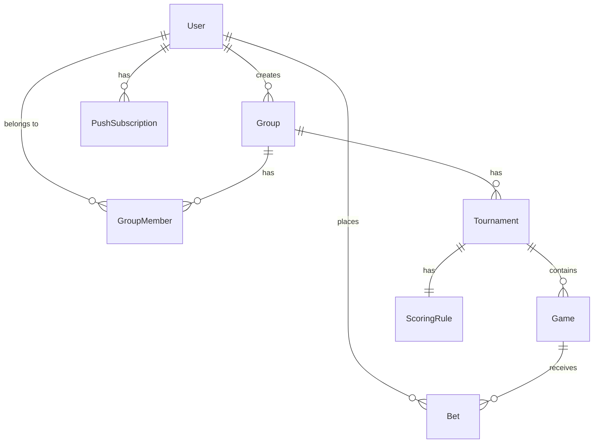

# Database Schema

> Prisma schema for the Football Betting App.  
> Copy this to `prisma/schema.prisma` during Phase 1 of the implementation.

```prisma
generator client {
  provider = "prisma-client-js"
}

datasource db {
  provider = "postgresql"
  url      = env("DATABASE_URL")
}

model User {
  id            String        @id @default(cuid())
  email         String        @unique
  passwordHash  String
  name          String
  createdAt     DateTime      @default(now())

  groupMembers       GroupMember[]
  bets               Bet[]
  createdGroups      Group[]            @relation("GroupCreator")
  pushSubscriptions  PushSubscription[]
}

model Group {
  id          String        @id @default(cuid())
  name        String
  createdAt   DateTime      @default(now())
  createdBy   String
  creator     User          @relation("GroupCreator", fields: [createdBy], references: [id])

  members     GroupMember[]
  tournaments Tournament[]
}

model GroupMember {
  id        String   @id @default(cuid())
  groupId   String
  userId    String
  isAdmin   Boolean  @default(false)
  joinedAt  DateTime @default(now())

  group     Group    @relation(fields: [groupId], references: [id])
  user      User     @relation(fields: [userId], references: [id])

  @@unique([groupId, userId])
}

model Tournament {
  id           String        @id @default(cuid())
  groupId      String
  name         String        // e.g. "World Cup 2026"
  season       String?       // e.g. "2026"
  createdAt    DateTime      @default(now())

  group        Group         @relation(fields: [groupId], references: [id])
  games        Game[]
  scoringRule  ScoringRule?
}

model ScoringRule {
  id                    String     @id @default(cuid())
  tournamentId          String     @unique
  exactScorePoints      Int        @default(3)
  correctOutcomePoints  Int        @default(1)

  tournament            Tournament @relation(fields: [tournamentId], references: [id])
}

model Game {
  id           String     @id @default(cuid())
  tournamentId String
  homeTeam     String
  awayTeam     String
  kickoffAt    DateTime
  homeScore    Int?       // null until admin enters result
  awayScore    Int?       // null until admin enters result
  createdAt    DateTime   @default(now())

  tournament   Tournament @relation(fields: [tournamentId], references: [id])
  bets         Bet[]
}

model Bet {
  id            String   @id @default(cuid())
  gameId        String
  userId        String
  homeScore     Int
  awayScore     Int
  pointsAwarded Int?     // null until game result is entered
  createdAt     DateTime @default(now())
  updatedAt     DateTime @updatedAt

  game          Game     @relation(fields: [gameId], references: [id])
  user          User     @relation(fields: [userId], references: [id])

  @@unique([gameId, userId])  // one bet per user per game
}

model PushSubscription {
  id        String   @id @default(cuid())
  userId    String
  endpoint  String   @unique
  p256dh    String
  auth      String
  createdAt DateTime @default(now())

  user      User     @relation(fields: [userId], references: [id], onDelete: Cascade)
}
```

## Entity Relationship Overview



## Key Constraints

| Constraint | Enforcement |
|---|---|
| One bet per user per game | `@@unique([gameId, userId])` |
| One scoring rule per tournament | `@unique` on `ScoringRule.tournamentId` |
| Game scores are nullable | `homeScore Int?` / `awayScore Int?` — null until result entered |
| Bet points are nullable | `pointsAwarded Int?` — null until result calculated |
| Push subscription endpoint unique | `@unique` on `PushSubscription.endpoint` — prevents duplicate registrations |
| Push subscriptions cascade-deleted | `onDelete: Cascade` — subscriptions are removed when a user is deleted |
